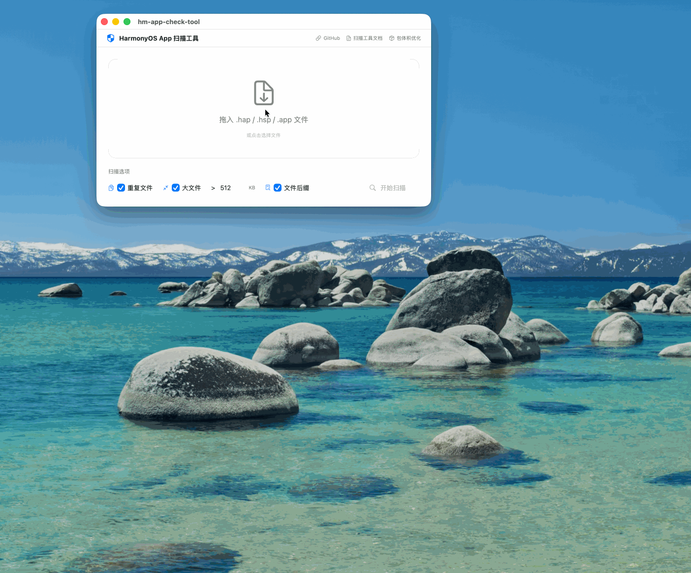
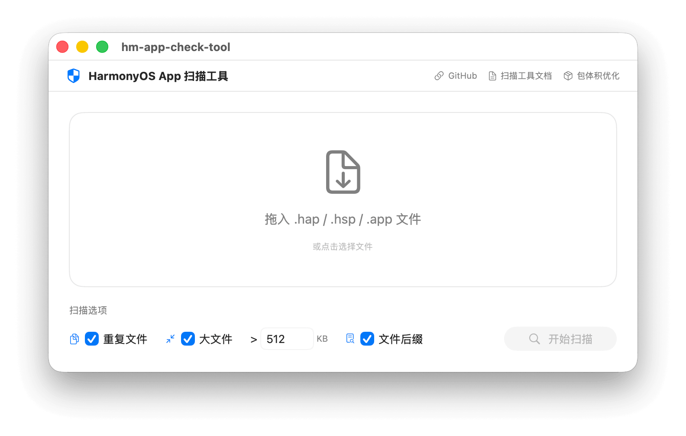
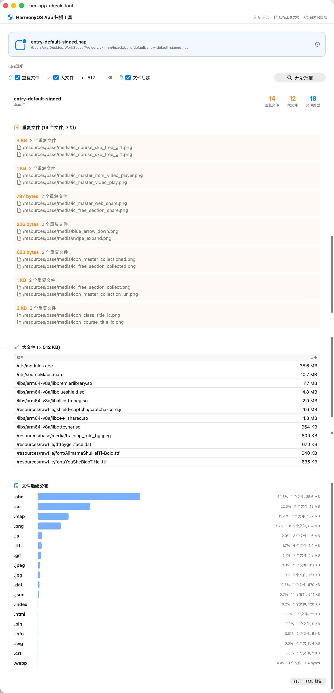

<p align="center">
  <a href="https://github.com/iHongRen/hm-app-check-tool/releases/latest"></a>
  <a href="https://github.com/iHongRen/hm-app-check-tool"></a>
  <a href="https://ihongren.github.io/donate.html"></a>
</p>
<p align="center">

# 鸿蒙应用包扫描工具 - [hm-app-check-tool](https://github.com/iHongRen/hm-app-check-tool)

鸿蒙应用包扫描工具，提供原生 macOS 图形界面，支持对 `.hap`、`.hsp`、`.app` 包内容扫描并输出检测结果报告，为开发者优化包结构或排查问题提供数据支撑。

## 功能特性

- **重复文件检测** — 基于 MD5 哈希查找包内重复文件，帮助减小包体积
- **大文件分析** — 扫描超过指定阈值的文件，可自定义阈值（默认 100 KB）
- **文件后缀分布** — 统计各类文件后缀的数量、大小及占比，直观展示包内文件构成
- **拖拽导入** — 支持拖拽或点击选择 `.hap` / `.hsp` / `.app` 文件，自动开始扫描
- **HTML 报告导出** — 扫描完成自动生成 HTML 报告，一键在浏览器中打开
- **原生 macOS 体验** — SwiftUI 原生界面，支持窗口自适应、链接跳转

## 截图



| 扫描中 | 扫描结果 |
|:---:|:---:|
|  |  |

## 环境要求

- **macOS 14.0+**
- **DevEco Studio** — 需安装 DevEco Studio，应用会自动查找 SDK 中的 `app_check_tool.jar`

## 快速开始

### 方式一：命令行安装（推荐）

```bash
curl -fsSL https://raw.githubusercontent.com/iHongRen/hm-app-check-tool/main/install.sh | bash
```

### 方式二：手动安装

1. 下载最新版本的 [hm-app-check-tool.dmg](https://github.com/iHongRen/hm-app-check-tool/releases) ，安装到 `应用程序`

2. 在终端执行下面命令，才能正常使用（未签名应用去除隔离属性）：

   ```sh
   xattr -dr com.apple.quarantine /Applications/hm-app-check-tool.app
   ```

### 开始使用

启动后拖入 `.hap` / `.hsp` / `.app` 文件，扫描将自动开始。查看结果后，可滚动到底部点击「打开 HTML 报告」在浏览器中查看详细报告。

## 从源码构建

```bash
git clone https://github.com/iHongRen/hm-app-check-tool.git
cd hm-app-check-tool
open hm-app-check-tool/hm-app-check-tool.xcodeproj
```

在 Xcode 中选择 **Product → Archive** 即可打包。

## 相关文档

- [扫描工具（app_check_tool）官方文档](https://developer.huawei.com/consumer/cn/doc/harmonyos-guides/app-check-tool)
- [应用包体积优化最佳实践](https://developer.huawei.com/consumer/cn/doc/best-practices/bpta-decrease_pakage_size#section1660158101012)


# 作者

[@仙银](https://github.com/iHongRen)

鸿蒙开源作品，欢迎持续关注 [🌟Star](https://github.com/iHongRen/https://github.com/iHongRen/) ，[💖赞助](https://ihongren.github.io/donate.html)

1、[hpack](https://github.com/iHongRen/hpack) - 鸿蒙 HarmonyOS 一键打包上传分发测试工具。

2、[Open-in-DevEco-Studio](https://github.com/iHongRen/Open-in-DevEco-Studio)  - macOS 直接在 Finder 工具栏上，使用

DevEco-Studio 打开鸿蒙工程。

3、[cxy-theme](https://github.com/iHongRen/cxy-theme) - DevEco-Studio 绿色护眼背景主题

4、[harmony-udid-tool](https://github.com/iHongRen/harmony-udid-tool) - 简单易用的 HarmonyOS 设备 UDID 获取工具，适用于非开发人员。

5、[SandboxFinder](https://github.com/iHongRen/SandboxFinder) - 鸿蒙沙箱文件浏览器，支持模拟器和真机

6、[WebServer](https://github.com/iHongRen/WebServer) - 鸿蒙轻量级Web服务器框架，类 Express.js API 风格。

7、[SelectableMenu](https://github.com/iHongRen/SelectableMenu) - 适用于聊天对话框中的文本选择菜单

8、[RefreshList](https://github.com/iHongRen/RefreshList) - 功能完善的上拉下拉加载组件，支持各种自定义。

9、[hm-app-check-tool](https://github.com/iHongRen/hm-app-check-tool) - macOS 鸿蒙扫描工具，扫描HAP、HSP、App包内容并输出检测结果报告